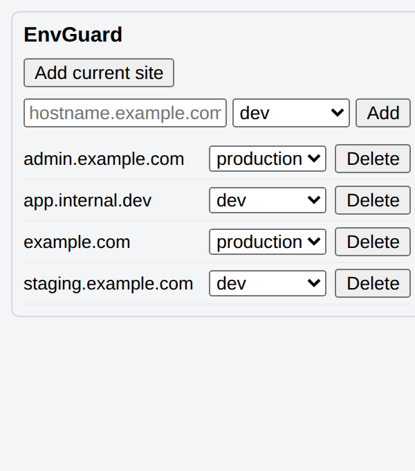
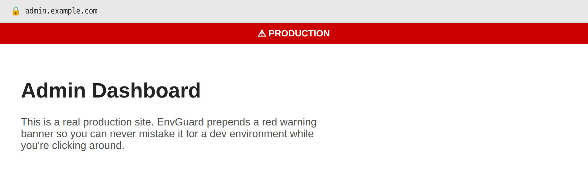
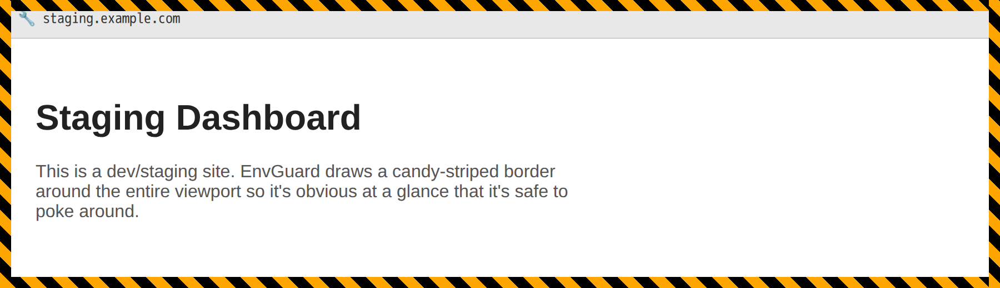

<div align="center">


# EnvGuard

**Never mistake a production tab for a dev one again.**

[](https://github.com/jlonborg/envguard/actions/workflows/release.yml)
[](https://github.com/jlonborg/envguard/releases/latest)
[](https://www.mozilla.org/firefox/)
[](manifest.json)

</div>

EnvGuard is a Firefox extension that lets you tag hostnames as **dev** or
**production** so you can never mistake which environment you're looking at.
Tagged production sites get a red warning banner at the top of the page, and
tagged dev sites get a candy-striped border frame around the viewport. The
toolbar icon also shows a "P" or "D" badge for the active tab's tagged
environment.

## Screenshots

<table>
<tr>
<td align="center" width="33%">
<br />
<sub>The popup — tag the current site or add one manually</sub>
</td>
<td align="center" width="33%">
<br />
<sub>Production sites get an unmissable red banner</sub>
</td>
<td align="center" width="33%">
<br />
<sub>Dev sites get a candy-striped border frame</sub>
</td>
</tr>
</table>

## Local development

EnvGuard is a plain, unbundled WebExtension — there's no build/compile step,
so "loading it" really is just pointing Firefox at `manifest.json`:

1. Open `about:debugging#/runtime/this-firefox` in Firefox.
2. Click **Load Temporary Add-on...**.
3. Select `manifest.json` from this repository.

The extension is loaded until you restart Firefox; after making changes,
click **Reload** on the same `about:debugging` page (no rebuild needed).

Optional: `npm install` and `npm run lint` runs `web-ext lint` against the
extension source, which is the same check the release workflow runs in CI.

## Usage

Click the toolbar icon to open the popup:

- **Add current site** tags the active tab's hostname as "dev". (This is
  disabled for pages without a hostname, e.g. `about:` pages.)
- Use the manual-add field to type a hostname and pick "dev" or "production"
  directly, without needing to visit the site first.
- Existing tags are listed below; change the dropdown to switch environment,
  or click "Delete" to remove a tag.

## Continuous integration

`.github/workflows/ci.yml` runs `web-ext lint` and `web-ext build` on every
push to `main` and on every pull request, so `main` shows a green check
before you release.

## Release process

`release.sh` bumps the version in `manifest.json`, commits, tags, and pushes:

```
./release.sh X.Y.Z
```

It must be run from a clean working tree on the `main` branch, in sync with
`origin/main`. It runs lint and build locally first, and (if the `gh` CLI is
installed and authenticated) checks that GitHub's combined commit status for
the current `main` commit is green before doing anything else — refusing to
tag and push a release otherwise. Pushing the `vX.Y.Z` tag then triggers
[`.github/workflows/release.yml`](.github/workflows/release.yml), which
builds and lints the extension again, signs it via the Mozilla AMO API, and
publishes a GitHub Release with the signed `.xpi` attached.

## Contributing

Contributions are welcome!

1. Fork the repository and create a branch for your change.
2. Follow the [Local development](#local-development) steps above to load
   the extension and try your change in Firefox.
3. Run `npm install && npm run lint` before opening a PR — this is the same
   `web-ext lint` check CI runs on every push and pull request.
4. Open a pull request against `main` with a clear description of what
   changed and why. Keep PRs focused — small, single-purpose changes are
   easier to review and merge.
5. CI must pass (see [Continuous integration](#continuous-integration))
   before a PR can be merged.

For bug reports or feature requests, please open a GitHub issue with steps
to reproduce (for bugs) or a clear description of the use case (for
features).
